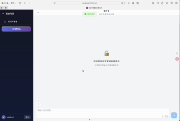
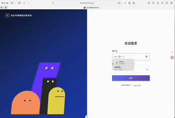

# 安全隐患识别智能问答服务

基于 FastAPI + LangChain + 通义大模型的安全隐患识别智能问答服务后端。

## 效果演示

<div>

### 用户认证


### 风险识别一



### 风险识别二


### 图片上传


### 历史记录



</div>

## 项目结构

```
.
├── api/              # API路由层
├── service/          # 业务逻辑层
├── entity/           # 数据实体层（SQLAlchemy ORM）
├── schema/           # 数据模型层（Pydantic）
├── core/             # 核心模块（配置、安全、异常）
├── utils/            # 工具函数
├── tools/            # 知识库工具
├── alembic/          # 数据库迁移
├── logs/             # 日志目录
└── screenshots/      # 截图资源
```

## 快速启动

```bash
# 激活虚拟环境
source .venv/bin/activate

# 启动服务
python main.py
```

服务地址：http://127.0.0.1:8000/docs

## 环境变量

主要配置在 `.env` 文件中，参考 `core/config.py` 的 Settings 类。

## 接口列表

### 认证相关

| 接口 | 方法 | 描述 |
|------|------|------|
| `/api/v1/user/register` | POST | 用户注册 |
| `/api/v1/user/login` | POST | 用户登录，获取token |

### 会话管理

| 接口 | 方法 | 描述 |
|------|------|------|
| `/api/v1/session/create` | POST | 创建新会话 |
| `/api/v1/session/update` | POST | 修改会话标题 |
| `/api/v1/session/list_user_sessions` | POST | 获取会话列表 |
| `/api/v1/session/session_history` | POST | 获取会话历史消息 |
| `/api/v1/session/clear_session_history` | POST | 清空会话历史 |

### 智能问答

| 接口 | 方法 | 描述 |
|------|------|------|
| `/api/v1/chat/ask` | POST | 智能问答（流式返回） |

### 文件管理

| 接口 | 方法 | 描述 |
|------|------|------|
| `/api/v1/file/upload_risk_images` | POST | 风险图片上传（最多5张，每张最大5MB） |
| `/api/v1/file/upload_knowledge` | POST | 知识文档上传（最大10MB） |

### 知识库管理

| 接口 | 方法 | 描述 |
|------|------|------|
| `/api/v1/knowledge/creat` | POST | 新增知识库信息 |
| `/api/v1/knowledge/update` | POST | 更新知识库信息 |
| `/api/v1/knowledge/delete` | POST | 删除知识库信息 |
| `/api/v1/knowledge/list` | POST | 查询知识库信息 |
| `/api/v1/knowledge/embedding` | POST | 知识库分块存储 |

## 认证方式

除注册、登录外，所有接口需要在请求头中携带 Token：

```
Authorization: {token}
```

## 依赖

- FastAPI
- SQLAlchemy 2.0
- LangChain
- 通义大模型 API
- Uvicorn
